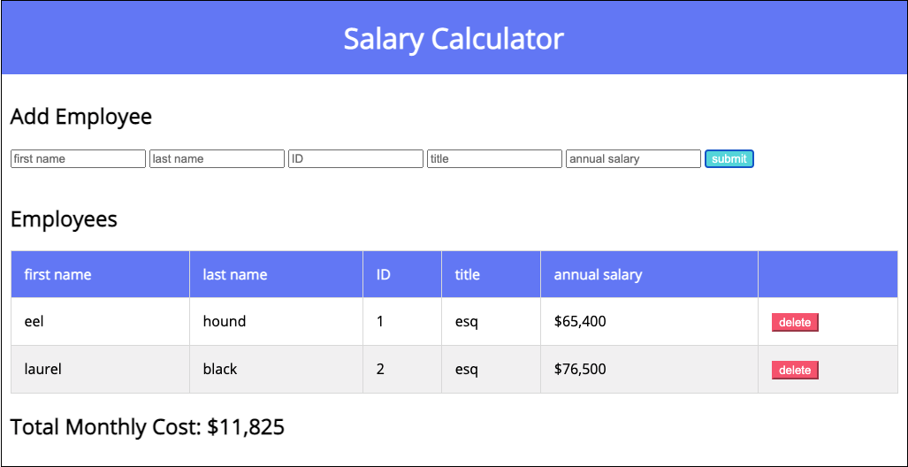
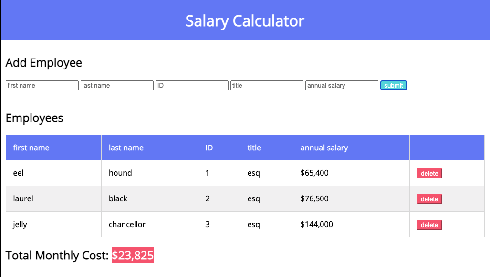

# Salary Calculator

## Description

Your project description goes here...

## Checklist

- [x] html, client.js, jquery.js, log "DOM ready"
- [x] building template in html (inputs / table)
- [x] add some styling for the table
- [x] button click that logs to the console
- [x] assign input to variables
- [x] append to the DOM using those variables
- [x] global variables for monthly cost
- [x] append monthly cost to the DOM
- [x] logic for background color on the monthly costs
- [x] delete button that removes a row

### stretch
- [ ] update the total cost on delete of a row
- [ ] array and objects to hold information
- [ ] alert the user of missing fields

## Screen Shot

The first image displays a couple sample employee inputs. The second image shows the total monthly cost highlighted when it exceeds a threshold, greater than $20k. Also, note the text changes to white for greater legibility.

## Built With

Built with love, sweat, tears, and support from my Proth cohort using Javascript, jQuery, HTML, and CSS.

## Acknowledgement

Thanks to Danny for working through the initial frustration of emptying an employee and deleting a row. Thanks to Mo for sharing his endless energy. Thanks for Piper for being so vulnerable and persistent. And thanks to the rest of my cohort for asking the questions I don't know/think to ask.
